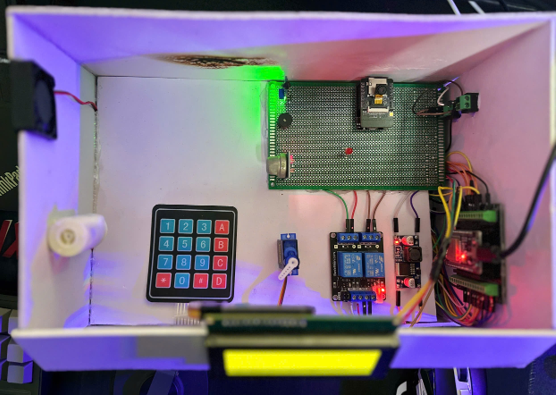
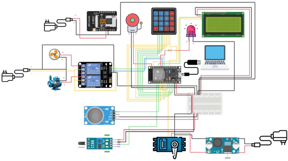
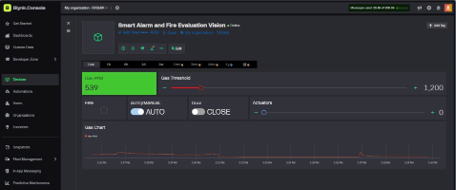
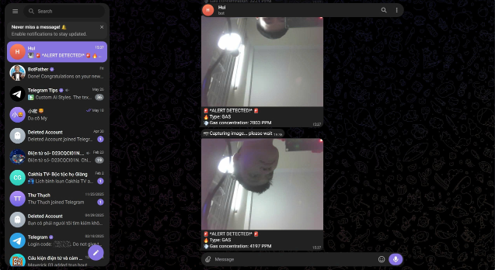
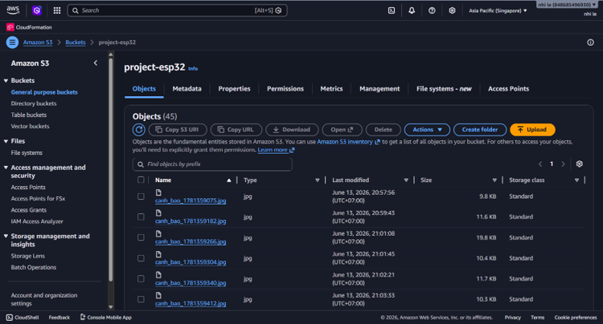
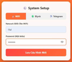
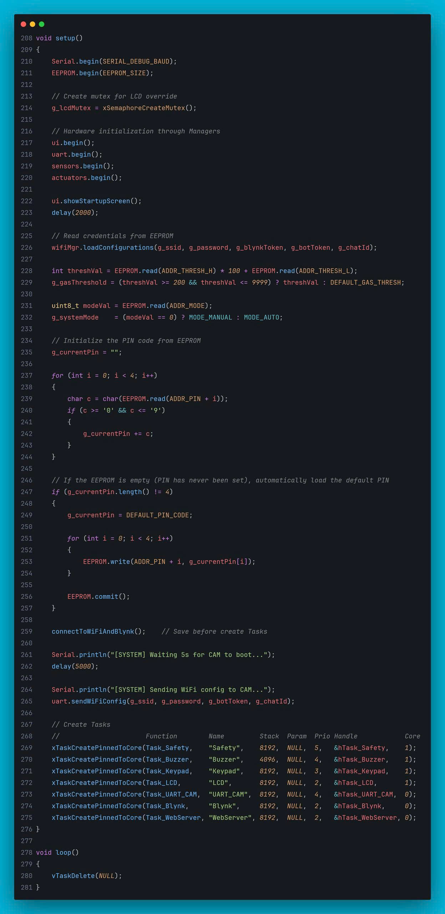

# 🔥 Smart Alert & Fire Evaluation Vision

**A distributed IoT safety system built on ESP32 — combining real-time embedded firmware, edge signal processing, and multi-cloud integration to detect fire and gas hazards before they become disasters.**


*A final-year IoT project by **Group 15 — D23CI**, Posts and Telecommunications Institute of Technology (PTIT), Ho Chi Minh City*

---

[🏗️ Architecture](https://claude.ai/chat/565e4e5e-d96e-4338-8c51-b78244fc59a8#-system-architecture) · [⚡ Technical Highlights](https://claude.ai/chat/565e4e5e-d96e-4338-8c51-b78244fc59a8#-technical-deep-dives) · [☁️ Cloud Integration](https://claude.ai/chat/565e4e5e-d96e-4338-8c51-b78244fc59a8#%EF%B8%8F-multi-cloud-integration) · [🧪 Test Results](https://claude.ai/chat/565e4e5e-d96e-4338-8c51-b78244fc59a8#-testing--results) · [🚀 Getting Started](https://claude.ai/chat/565e4e5e-d96e-4338-8c51-b78244fc59a8#-getting-started) · [💡 What I Learned](https://claude.ai/chat/565e4e5e-d96e-4338-8c51-b78244fc59a8#-what-i-learned)

---

## 📸 Visual Showcase

### The Hardware

A clean, well-lit top-down or 3/4-angle shot of the complete assembled system — ESP32 Master board, ESP32-CAM Slave, MQ-2 sensor, flame sensor, relay module, servo motor, LCD 20x4, keypad, and the independent power adapters.



### System at a Glance

> The detailed block diagram showing Master node, Slave node, sensors, actuators, and cloud blocks. This tells the reader everything about the system architecture in one shot.



---

### Live Dashboard — Blynk IoT

The Blynk app interface with the real-time Gas (PPM) graph, device status indicators (fan, pump, door), and the AUTO/MANUAL toggle switch. Ideally captured during a test scenario where the gas PPM is rising.



---

### Emergency Alert — Telegram

The Telegram chat showing a received alert message with the field photo attached, Markdown-formatted text showing gas concentration and event type. This is one of the most impressive visual outputs of the project.



---

### Cloud Storage — AWS S3

The AWS S3 management console listing the uploaded `.jpg` incident files, with their timestamp-based naming clearly visible.



---

### Dynamic Configuration — Captive Portal

 The local WebServer configuration page (accessible at `192.168.4.1`) with input fields for SSID, password, Blynk Token, and Telegram Bot Token.

      

---

### Code — The Setup



---

## 🧩 What Problem Does This Solve?

Most commercial fire alarm systems — even premium ones like Google Nest Protect — operate as **open-loop systems**: they *detect and alert*, then leave the response entirely to humans. They also lack cameras, making it impossible to verify whether an alert is real or false, which leads to complacency.

This project builds a **closed-loop safety system** that:

- **Acts autonomously**: activates ventilation fans, water pump, and unlocks the emergency door the moment a hazard is confirmed.
- **Visually verifies threats**: an onboard camera captures the scene and sends the photo directly to your Telegram in under 3 seconds.
- **Eliminates false alarms**: a Kalman filter + oversampling pipeline and a 3-second hysteresis debounce mechanism ensure the system only reacts to *sustained, real* hazards — not a momentary ADC spike.

---

## 🏗️ System Architecture

The system is built around a **distributed Master–Slave architecture** connected over a high-speed UART link, separating safety-critical logic from compute-heavy vision tasks.

```
┌──────────────────────────────────────────────────────────────┐
│                     MASTER NODE                              │
│              ESP32 WROOM-32 (Dual-Core)                      │
│                                                              │
│  Core 1 (Real-time, HIGH priority)                           │
│  ├── Task_Safety  → Read sensors, run FSM, trigger actuators │
│  ├── Task_Buzzer  → Generate alarm sound patterns            │
│  ├── Task_Keypad  → Debounced 4x4 matrix scanning            │
│  └── Task_LCD     → Update HMI display                       │
│                                                              │
│  Core 0 (Network stack, LOW priority)                        │
│  ├── Task_Blynk   → Sync data to Blynk Cloud                 │
│  └── Task_WebServer → Serve Captive Portal config page       │
│                                                              │
│  Sensors: MQ-2 (Gas/Analog) + Flame Sensor (IR/Digital)      │
│  Actuators: Relay x2, Servo SG90, Buzzer, LED                │
│  HMI: LCD 20x4 (I2C) + Keypad 4x4                            │
└───────────────────────┬──────────────────────────────────────┘
                        │ 
                        │ UART2 @ 115200 bps
                        │ JSON-encoded messages + \n delimiter
                        │
┌───────────────────────▼─────────────────────────────────────┐
│                     SLAVE NODE                              │
│              ESP32-CAM (OV3660 sensor)                      │
│                                                             │
│  Super Loop Architecture                                    │
│  ├── Parse incoming JSON commands from Master               │
│  ├── Capture JPEG frame from OV3660                         │
│  ├── Encode image to Base64 → HTTP POST → AWS S3            │
│  └── Send image as multipart/form-data → Telegram Bot API   │
└─────────────────────────────────────────────────────────────┘
```

### Why Separate the Two MCUs?

The ESP32-CAM's SSL/TLS handshake and JPEG encoding are memory-hungry operations that can consume **hundreds of KB of heap RAM**. Offloading this to a dedicated Slave node means the Master's critical safety tasks — sensor reading, FSM evaluation, actuator control — are never blocked by network latency or memory pressure.

---

## ⚡ Technical Deep Dives

This section explains the *engineering decisions* behind the system — the "why" behind each approach. These are the parts you won't find in a product datasheet.

---

### 1. 🧠 Killing Ghost Alarms: Kalman Filter + Oversampling on the Edge

**The problem:** The MQ-2 gas sensor outputs an analog voltage. When the ESP32's WiFi radio transmits data, it causes microsecond voltage dips on the shared power rail — which the ADC reads as random spikes. Without filtering, the system would trigger false alarms every time it pushes data to Blynk.

**The solution — a two-stage DSP pipeline running entirely on the MCU:**

```
Stage 1: Oversampling
─────────────────────
Take 20 ADC readings, each 2ms apart → compute the mean
→ Eliminates high-frequency electromagnetic noise (EMI)

Stage 2: Kalman Filter
──────────────────────
Parameters: R (measurement noise) = 2.0
            Q (process noise)     = 0.1
            P (estimation error)  = 2.0
→ Smooths residual low-frequency drift
→ Output: a clean PPM trend curve with no spikes
```

**The result:** 100% noise rejection in 20 test runs. No false alarms caused by ADC interference. The Blynk graph shows a perfectly smooth PPM curve instead of a jagged noisy line.

---

### 2. ⚡ Real-Time Guarantee: FreeRTOS Dual-Core Task Pinning

**The problem:** A single-loop Arduino sketch (`delay()`-based) would make the alarm response wait for the WiFi library to finish its business. In a fire scenario, every millisecond counts.

**The solution:** FreeRTOS tasks are *pinned* to specific CPU cores using `xTaskCreatePinnedToCore()`:

| Core | Task | Priority | Responsibility |
| --- | --- | --- | --- |
| Core 1 | `Task_Safety` | 4 (Highest) | Sensor reading + FSM + actuator control |
| Core 1 | `Task_Buzzer` | 5 | Alarm sound generation |
| Core 1 | `Task_Keypad` | 3 | Physical input debouncing |
| Core 0 | `Task_Blynk` | 2 | Cloud data sync |
| Core 0 | `Task_WebServer` | 1 | Captive Portal |

**The result:** Even in a stress test where we intentionally saturated the WiFi stack on Core 0, the relay and servo responded to a hazard in **under 500ms** — unaffected by network congestion.

---

### 3. 🛡️ Hysteresis Anti-Spike: The 3-Second Safety Gate

**The problem:** Even after Kalman filtering, we don't want a single above-threshold reading to immediately trigger a full emergency response. A brief gas spike from cooking steam could cause unnecessary panic.

**The solution:** A software counter (`gasConfirmCount`) that only acknowledges a gas alarm after the PPM has *continuously* exceeded the threshold for **6 consecutive scan cycles (= 3 seconds)**:

```
Cycle 1: Gas > threshold → gasConfirmCount = 1
Cycle 2: Gas > threshold → gasConfirmCount = 2
...
Cycle 5: Gas drops below (threshold - HYSTERESIS) → gasConfirmCount = 0  ← RESET
...
Cycle 6+6: Gas stays high for 6 full cycles → 🚨 ALARM CONFIRMED
```

This is the same "hysteresis" principle used in industrial PLC safety systems. **False alarm rate: 0% in 20 test runs.**

---

### 4. 🔗 Inter-MCU Protocol: JSON over UART

Instead of a raw byte protocol, both nodes speak structured JSON. This makes the communication self-describing, extensible, and easy to debug with a serial monitor:

```json
// Master → Slave: Initial network configuration
{
  "cmd": "WIFI",
  "ssid": "YourNetwork",
  "pass": "YourPassword",
  "tgToken": "your_telegram_bot_token",
  "tgChatId": "your_chat_id"
}

// Master → Slave: Emergency capture command
{
  "cmd": "ALERT",
  "event": "GAS",
  "ppm": 1247
}

// Master → Slave: Manual patrol snapshot
{
  "cmd": "SNAPSHOT"
}

// Master → Slave: Periodic heartbeat (sent every Task_Safety cycle)
{
  "cmd": "SAFE",
  "ppm": 83
}
```

Each message is terminated with a `\n` newline character. The Slave flushes its `rxBuf` after every parse — regardless of success or failure — to prevent memory leaks from corrupted frames.

---

### 5. 🔒 Finite State Machine (FSM) — The Safety Logic Core

The system operates as a 4-state FSM. All actuator decisions are derived from the current state rather than scattered `if/else` chains throughout the code:

```
                    ┌───────────────┐
        (all clear) │   STATE_SAFE  │ (all clear)
          ┌─────────│   Relay: OFF  │◄────────────┐
          │         │  Servo: CLOSE │             │
          │         │  Buzzer: OFF  │             │
          │         └───────┬───────┘             │
          │                 │                     │
       gas only         gas + fire             fire only
          │              or S.O.S                 │
          ▼                 ▼                     ▼
  ┌──────────────┐  ┌───────────────┐  ┌───────────────────┐
  │ STATE_GAS    │  │STATE_EMERGENCY│  │ STATE_FIRE        │
  │Fan: ON       │  │Fan: ON        │  │ Pump: ON          │
  │Servo: OPEN   │  │Pump: ON       │  │ Servo: OPEN       │
  │Buzzer: ALARM │  │Servo: OPEN    │  │ Buzzer: ALARM     │
  │Cam: SNAPSHOT │  │Buzzer: MAX    │  │ Cam: SNAPSHOT     │
  └──────────────┘  │Cam: SNAPSHOT  │  └───────────────────┘
                    └───────────────┘
```

**S.O.S Override:** If a user presses `C` on the keypad, the `g_sosActive` flag is set and the FSM *immediately* jumps to `STATE_EMERGENCY`, bypassing all sensor readings. This is the physical "panic button" for when a person sees danger that the sensors haven't caught yet.

---

## ☁️ Multi-Cloud Integration

| Platform | Protocol | Role |
| --- | --- | --- |
| **Blynk IoT** | TCP/IP (Virtual Pins V0–V5) | Real-time data visualization + manual control (AUTO/MANUAL mode) |
| **AWS S3** | HTTP POST via API Gateway | Long-term storage of incident photos (Base64-encoded JPEG) |
| **Telegram Bot API** | HTTPS / TLS (port 443) | Instant push notification with field photo + environment readings |
| **Local WebServer** | HTTP (port 80) + DNS Captive Portal | On-device network and API token configuration via browser UI |

### How Telegram Image Delivery Works

The image pipeline from capture to your phone screen happens entirely on the Slave node:

```
OV3660 Camera
     │
     ▼ (DVP/CSI interface)
Frame Buffer (JPEG in RAM)
     │
     ▼ WiFiClientSecure → TLS handshake (skip cert verification to save RAM)
multipart/form-data payload:
  ├── photo: [raw JPEG bytes]
  └── caption: "🚨 FIRE DETECTED\nGas: 1247 PPM\nEvent: GAS_ONLY"
     │
     ▼ HTTPS POST → api.telegram.org:443
     │
     ▼ Delivered to your phone in ~1.5–3.5 seconds
```

---

## 🔧 Hardware Design Highlights

### Why 4 Independent Power Supplies?

Sharing a single power rail across the ESP32, relay coils, servo motor, and camera module is the fastest path to mysterious system resets and ADC measurement errors.

| Supply | Powers | Reason for Isolation |
| --- | --- | --- |
| USB 5V (from PC/laptop) | ESP32 Master + analog peripherals | Stable reference for ADC measurements; USB also provides serial debug access |
| Adapter 5V/2A #1 | ESP32-CAM Slave | Peak draw &gt;300mA during WiFi TX + flash LED; must not dip the Master's ADC rail |
| Adapter 5V/2A #2 | Relay module coils | Flyback voltage spike from relay coil inductance would destroy GPIO pins without isolation |
| Adapter 12V/2A + LM2596 buck converter | Servo SG90 | Startup current can reach 1–2A; LM2596 handles 3A max, provides instant current delivery without sag |

### Relay Driver Circuit: Why We Can't Drive a Relay Directly from GPIO

An ESP32 GPIO pin can source a maximum of \~12–40mA. A relay coil needs much more than that — and generates a large inductive kickback voltage when switched off that would fry the GPIO.

The solution is a **BJT driver stage** (S8050 NPN transistor) with a **flyback diode** (1N4148) across the relay coil:

```
GPIO (3.3V) ──[R_base]──► B (S8050 NPN)
                           │
                          C ──► Relay Coil ──► 5V
                           │
                          E ──► GND

Flyback protection: 1N4148 diode across coil (cathode to 5V, anode to collector)
```

When the relay turns off, the diode provides a safe current path for the collapsing magnetic field — dissipating it as heat instead of a voltage spike.

---

## 🧪 Testing & Results

The system was subjected to **20 independent test runs** per scenario using real stimuli: a gas lighter sprayed directly at the MQ-2 sensor (gas test) and an open flame held near the flame sensor (fire test).

| Test Criterion | Target | Result | Pass/Fail |
| --- | --- | --- | --- |
| ADC noise cancellation (Kalman + Oversampling) | 100% | **20/20 (100%)** | ✅ PASS |
| 3-second hysteresis debounce (anti-false-alarm) | ≥ 85% | **9/10 (90%)** | ✅ PASS |
| Actuator response time (Relay + Servo) | &lt; 500ms | **20/20 (100%)** | ✅ PASS |
| UART JSON inter-MCU communication | ≥ 85% | **9/10 (90%)** | ✅ PASS |
| Blynk data sync latency | &lt; 1 second | **20/20 (100%)** | ✅ PASS |
| Telegram + AWS image delivery | ≥ 85% | **9/10 (90%)** | ✅ PASS |

**Note on the 10% UART failures:** Corruption occurred due to inductive EMI from the Servo motor sharing the GND reference line with signal wiring. The Slave's `rxBuf = ""` flush mechanism correctly detected and discarded the malformed frames — the system remained stable and simply re-requested on the next cycle.

### Scenario Deep Dive: Gas Leak Response Timeline

| Time (ms) | Event |
| --- | --- |
| 0 | Gas concentration crosses configured PPM threshold |
| 0–2500 | `gasConfirmCount` increments each 500ms cycle — **actuators hold** (anti-false-alarm gate) |
| 3000 | `gasConfirmCount` reaches 6 — `STATE_GAS_ONLY` confirmed |
| 3000 | Fan relay energizes, Servo rotates to 90° (door open), Buzzer starts |
| 3000 | Master fires `{"cmd":"ALERT","event":"GAS","ppm":XXXX}` over UART |
| \~3100 | Slave receives command, OV3660 captures JPEG |
| \~4800 | Telegram notification with photo delivered to phone |

---

## 📁 Project Structure

```
Smart-Alarm-and-Fire-Evaluation-Vision/
│
├── 📁 master-node/              ← ESP32 WROOM-32 firmware
│   ├── 📁 include/
│   │   ├── ActuatorManager.h    ← Relay, Servo, Buzzer control API
│   │   ├── SensorManager.h      ← Kalman filter + Oversampling pipeline
│   │   ├── UIManager.h          ← LCD display + Keypad matrix scanning
│   │   ├── UartCommManager.h    ← JSON packet serialization/deserialization
│   │   ├── WifiConfigManager.h  ← Captive Portal + EEPROM config map
│   │   └── Config.h             ← Pin assignments + threshold constants
│   ├── 📁 src/
│   │   ├── main.cpp             ← FreeRTOS task registration + boot sequence
│   │   ├── ActuatorManager.cpp
│   │   ├── SensorManager.cpp
│   │   ├── UIManager.cpp
│   │   ├── UartCommManager.cpp
│   │   └── WifiConfigManager.cpp
│   └── platformio.ini           ← Build config for env:esp32dev
│
├── 📁 slave-node/               ← ESP32-CAM firmware
│   ├── 📁 include/
│   │   ├── CameraManager.h      ← OV3660 init + frame buffer management
│   │   ├── CloudManager.h       ← AWS S3 (Base64) + Telegram (Multipart) upload
│   │   └── Config.h
│   ├── 📁 src/
│   │   ├── main.cpp             ← Super Loop + UART JSON parser
│   │   ├── CameraManager.cpp
│   │   └── CloudManager.cpp
│   └── platformio.ini           ← Build config for env:esp32cam
│
├── 📁 assets/
│
└── README.md
```

---

## 🚀 Getting Started

### Prerequisites

- **Hardware:** ESP32 WROOM-32, ESP32-CAM (OV3660), MQ-2 sensor, IR flame sensor, 4x4 keypad, LCD 20x4 + I2C module, 2-channel relay module, Servo SG90, Buzzer, LEDs
- **Software:** [Visual Studio Code](https://code.visualstudio.com/) + [PlatformIO IDE extension](https://platformio.org/platformio-ide)
- **USB Driver:** CP210x or CH340 (for flashing via USB)
- **Accounts:** [Blynk IoT](https://blynk.io/) (free tier), [Telegram Bot](https://core.telegram.org/bots) (free), AWS account (for S3)

### Step 1: Clone and Open

```bash
git clone https://github.com/coldbrewtonic22/Smart-Alarm-and-Fire-Evaluation-Vision.git
cd Smart-Alarm-and-Fire-Evaluation-Vision
code .   # Opens in VS Code
```

PlatformIO will automatically detect both environments in `platformio.ini` and download all required libraries (`ArduinoJson`, `SimpleKalmanFilter`, `Blynk`, `ESP32Servo`, etc.).

### Step 2: Flash the Firmware

```bash
# Flash Master node (ESP32 WROOM-32)
# In PlatformIO: select env:esp32dev → Upload

# Flash Slave node (ESP32-CAM)
# In PlatformIO: select env:esp32cam → Upload
```

### Step 3: First-Time Configuration (Captive Portal)

On the very first boot (or after clearing EEPROM), the LCD will display `No credentials!` and the Master will broadcast a WiFi access point named `ESP32`.

1. Connect your phone to the `ESP32` WiFi network (no password required).
2. A configuration page will automatically open in your browser (or navigate to `192.168.4.1`).
3. Enter your home WiFi credentials, Blynk Auth Token, Telegram Bot Token, and Chat ID.
4. Tap **Save**. The system writes all values to EEPROM and reboots automatically.

### Step 4: Local Keypad Controls

| Key | Action |
| --- | --- |
| `A` | Display system IP and cloud connection status on LCD |
| `B` (from `*` menu) | Force an immediate patrol snapshot → Telegram |
| `C` | Activate S.O.S flag → forces `STATE_EMERGENCY` instantly |
| `D` (from `*` menu) | Enter PIN change flow (old PIN → new 4-digit PIN → saved to EEPROM) |
| `0–9` + `#` | Enter 4-digit PIN to silence the buzzer during an active alarm |
| `*` | Open quick-access menu |

---

## 💡 What I Learned

This section is for anyone who wants to build something similar — the lessons that aren't in any datasheet.

### 1. "Works on desk" ≠ "Works in a box"

The biggest surprise was how much the physical assembly matters. The relay's flyback voltage and the servo's inductive kickback caused random resets and corrupted UART frames that *never appeared during breadboard testing*. Hardware isolation isn't optional — it's load-bearing.

### 2. Shared GND is not "just GND"

Running high-current actuators (relay, servo) on the same ground reference as sensitive ADC inputs creates a "ground bounce" effect. The MQ-2 sensor read up to 15% higher gas concentrations the moment the relay clicked — because the voltage reference shifted. Separate power supplies with a common GND star-point would have been the cleaner solution.

### 3. FreeRTOS priority inversion is a real debugging rabbit hole

We had a bizarre bug where the LCD would freeze exactly when Blynk was reconnecting after a WiFi drop. The root cause: `Task_LCD` was calling `lcd.print()` — which uses I2C — while `Task_WebServer` was also attempting I2C in the background. The fix: a FreeRTOS Mutex (`xSemaphoreCreateMutex`) guards every I2C transaction. Now both tasks queue politely.

### 4. The Slave's heap is precious, handle it carefully

The `esp_camera_fb_get()` call allocates a frame buffer in the ESP32-CAM's limited PSRAM. If you forget to call `esp_camera_fb_return(fb)` after uploading the image, heap memory fragments across cycles and the board crashes after \~10 captures. Every `malloc` needs its `free`.

### 5. JSON over UART is surprisingly reliable

We considered raw binary framing for speed, but the ArduinoJson library's overhead is negligible at 115200 bps, and the readability advantage during debugging is enormous. Being able to open a serial monitor and read `{"cmd":"ALERT","event":"GAS","ppm":1247}` in plain text saved us hours of guesswork.

---

## 🔮 Known Limitations & Future Work

| Limitation | Root Cause | Proposed Fix |
| --- | --- | --- |
| Servo jitters under heavy actuator load | Shared GND bounce when relay + buzzer activate simultaneously | PCB with isolated ground planes for signal and power domains |
| Blynk sync delay (2–5s) under congested WiFi | Free-tier rate limiting + single WiFi antenna | Self-hosted MQTT broker (Mosquitto) + InfluxDB + Grafana dashboard |
| Blurry Telegram photos in low light | OV3660's small pixel sensor has limited dynamic range | Upgrade Slave to ESP32-S3 + IR-cut camera for night vision |
| UART JSON corruption under EMI | Inductive EMI from Servo bleeds into signal wiring | Shielded twisted-pair signal lines; hardware CRC on UART frame |
| No AI verification of alarms | System relies solely on threshold-based sensors | TinyML on-device (MobileNetV2 / YOLO-Tiny) for visual flame/smoke confirmation |

---

## 👥 Team

| Name | Role | Key Contributions |
| --- | --- | --- |
| **Vũ Minh Quân** | Software Lead & System Architect | FreeRTOS firmware, Kalman filter, Captive Portal, EEPROM config, Git management |
| **Lê Ngọc Yến Nhi** | Cloud Integrator | UART JSON protocol, AWS Base64 pipeline, Telegram API, Heartbeat & Serial log system |
| **Trần Tiến Lộc** | Hardware Engineer | Schematic design, independent power supply architecture, component soldering & assembly |
| **Nguyễn Quang Bảo Huy** | Hardware Engineer | PCB wiring, EMI shielding, signal integrity testing, enclosure fabrication |

*Supervisor: **Phạm Quốc Hợp** — Posts and Telecommunications Institute of Technology (PTIT), HCMC Campus*

---

## 🔗 Links

- 📂 **GitHub Repository:** [coldbrewtonic22/Smart-Alarm-and-Fire-Evaluation-Vision](https://github.com/coldbrewtonic22/Smart-Alarm-and-Fire-Evaluation-Vision)
- 🎬 **Demo Video:** [Watch on YouTube](https://youtu.be/i6-pnpFz0wI)

---


*Built with curiosity, debugged with patience, and documented to share.*

*© 2026 Group 15 — D23CI, PTIT HCMC. Academic use only.*